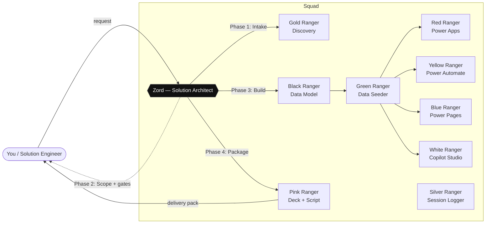

# PowerSquad


A squad of specialist agents that take a **Dynamics 365 / Power Platform** demo, PoC,
or customization from a vague client request all the way to a packaged, presentable
deliverable — including the working artifacts, a business-value deck, and a presentation script.

Built for a Solution Engineer workflow. Designed to be **reusable across clients**.

## The squad (Power Rangers cast names)

> Internal names are flavor + identity. Display names are plain and editable — anyone who
> forks this squad can rename the agents to whatever suits their team.

| # | Internal name | Display name | Owns |
|---|---|---|---|
| 1 | **Zord** | Solution Architect | Leads, scopes, gates everything before build |
| 2 | **Gold Ranger** | Discovery Analyst | Pulls client context (CRM Sales + WorkIQ) |
| 3 | **Black Ranger** | Data Modeler | Dataverse tables, columns, relationships |
| 4 | **Green Ranger** | Data Seeder | Realistic demo data |
| 5 | **Red Ranger** | Power Apps Builder | Canvas & model-driven apps |
| 6 | **Yellow Ranger** | Power Automate Builder | Cloud flows |
| 7 | **Blue Ranger** | Power Pages Builder | Public/portal sites |
| 8 | **White Ranger** | Copilot Studio Builder | Conversational agents |
| 9 | **Pink Ranger** | Storyteller | Deck + presentation script |

The combined, packaged deliverable is called the **delivery pack**.

## How it works (4 phases)



1. **Intake** — You tell Zord about the client (name, client/opportunity ID, meetings, chats).
 Gold Ranger gathers context from CRM Sales and WorkIQ.
2. **Scope** — Zord discusses with you: business value, low-hanging fruit, what to build.
 Zord runs the **autonomy gate** and only proceeds once scope is clear.
3. **Build** — The specialist agents execute in dependency order (data model → data →
 apps/flows/pages/agent), each in the demo org, packaged into a Dataverse **solution**.
 Red / Yellow / Blue / White Ranger run in parallel once the model + seed data exist.
4. **Package** — Pink Ranger produces the deck + script. Everything ships as **the delivery pack**.

See `workflow.md` for the full flow and `execution-surface.md` for the concrete tooling
each agent uses. Agent playbooks live in `agents/`. Reusable assets live in `library/`.

## Setup (first time)

PowerSquad builds in **your own** demo environment, so it needs a few details
(org URL, tenant, admin identity, MCP name). You provide them **once**; they're
stored in a **git-ignored `.env`** — your tenant details are never committed.

```pwsh
pwsh ./setup/setup-powersquad.ps1 # interactive
# or: copy setup\.env.example .env and edit it
```

See **`setup/SETUP.md`** for what each value is. On activation, Zord runs the
**setup gate** (`setup/setup-gate.md`) and won't build until `.env` is complete.

## Quick start

Once configured, just tell Scout:

> "I need to prepare a demo/PoC for client X. The client/opportunity ID is ...,
> I had meetings on ..., and chatted with so-and-so about it."

Scout adopts **Zord** and runs the flow. (Triggered by the entry skill in
`.copilot/m-skills/powersquad/`.)

## Talk directly to one agent (skip Zord)

Address any agent by name and Scout adopts that single playbook for a scoped task:

> "White Ranger, add an FAQ topic to the agent."
> "Green Ranger, seed 20 more accounts."
> "Black Ranger, add a status column to table X."

Direct-invoked agents still honor every guardrail and check their prerequisites first
(e.g. Red Ranger needs tables); if context is missing they ask or pull Zord in.

## Guardrails (apply to every agent)

- **Build with the NATIVE tenant admin identity** (browser + all CLIs/MCP). Cross-tenant guests
 cause 404s, "environment not found", and orphaned ownership. See `identity.md`.
- **Build only in the demo org** (`${DEMO_ORG_HOST}`). Never write to CRM Sales —
 CRM Sales is read-only context.
- **Client data is private.** Never leak real client data from CRM Sales/WorkIQ into shareable
 artifacts (decks, seeded data, screenshots). Anonymize or synthesize.
- **Everything goes into the delivery solution** so it can be exported/cleaned up. **Zord owns this**:
 she creates/identifies the solution, broadcasts its name to every builder, and audits membership
 (backfilling orphans). **Training solution = `psq_demo`.** Power Pages sites are solution-aware
 (enhanced data model) — Blue Ranger sets the Current solution + adds the site via Solutions → Add existing.
 **Only Pink Ranger is exempt** (deck/script save to the PC/`library/`).
- **Zord gates the build** with TWO gates: the **autonomy gate** and the **prerequisite gate**
 (which surfaces manual steps — admin sign-in, MFA, tenant toggles, open Studio tab). No
 specialist starts until both are cleared.
- **No redundancy + always backfill (data rules).** Never create a component that duplicates what another
 already models (e.g. a manual `Stage` column when a BPF already tracks stages). When you add a column to a
 table that has rows, **backfill values for ALL existing rows** — a demo must never show empty fields. Before
 deleting a column, run `RetrieveDependenciesForDelete` first. Details in `agents/03-black-ranger-data-modeler.md`.
- **Capture validated learnings in the specs, not just memory.** Whenever we discover/validate a how-to,
 gotcha, or rule together, write it into the relevant `agents/*.md` (or the shared docs) so it's
 version-controlled and visible to the whole squad — Copilot Memory alone is personal and not in the repo.
- **Keep a copy of ANY code we write in `library/code/` + index it.** Code apps, PCF, React/Vite, form-scripting JS,
 Power Fx snippets, plug-ins, embed snippets — drop a copy under `library/code/<name>/` and add a row to
 `library/code/INDEX.md` so we can find/reuse it. Critical because some artifacts (esp. **Code apps** — `pac code`
 is push-only, no pull/clone) **can't be recovered from Power Platform** if the local source is lost.

## Key docs

- `setup/SETUP.md` — first-time environment configuration (`.env`) + the setup gate.
- `workflow.md` — the 4-phase flow + the two gates.
- `execution-surface.md` — concrete tools + auth per agent (see §3b Identity).
- `identity.md` — **the native-admin identity strategy + open decision.**
- `frameworks.md` — Assist→Execute, the six patterns, maturity, Agent Store.
- `agents/*.md` — per-agent playbooks (Red Ranger `05` has per-app-type prereqs).
- `library/` — reuse assets.

## Reference channels (video, squad-wide)
- **Official Microsoft product YouTube channels** (e.g. `@MicrosoftCopilotStudio`) and the Power
 Platform community are useful across all builders. Treat videos as **learning/reference**, not as
 validated steps — validate hands-on and capture the result in the relevant spec.

## Docs access (squad-wide)
- **Microsoft Learn MCP** is the **preferred way to consult Microsoft docs** (efficient search/fetch) — use it on
 demand instead of scraping large doc pages. Canonical hubs per agent: Power Platform Developer docs
 (`learn.microsoft.com/power-platform/developer/`), Copilot Studio (`learn.microsoft.com/microsoft-copilot-studio`),
 the AI hub (`learn.microsoft.com/ai`), the Copilot family (`learn.microsoft.com/copilot`). Don't memorize docs —
 query them per task and capture only the validated result into the relevant spec.
